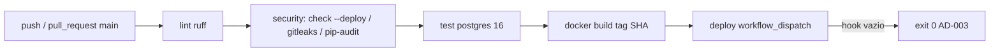
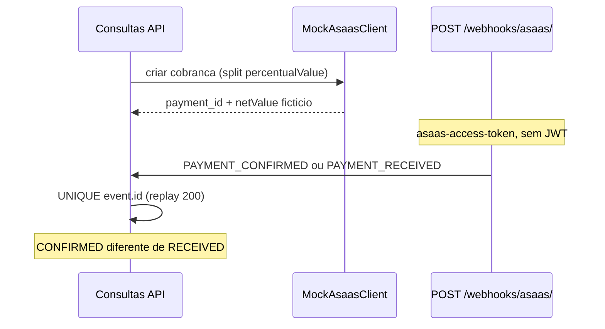

# Arquitetura (visão da entrega)

Dois diagramas para o revisor. O runtime é um monólito Django no Render; AWS é blueprint (ADR-0002).

## Pipeline CI

```mermaid
flowchart LR
  PR[push / pull_request main] --> Lint[lint ruff]
  Lint --> Sec[security: check --deploy / gitleaks / pip-audit]
  Sec --> Test[test postgres 16]
  Test --> Build[docker build tag SHA]
  Build --> Deploy[deploy workflow_dispatch]
  Deploy -->|hook vazio| Skip[exit 0 AD-003]
```

## Split Asaas e webhook

```mermaid
sequenceDiagram
  participant API as Consultas API
  participant Mock as MockAsaasClient
  participant WH as POST /webhooks/asaas/
  API->>Mock: criar cobranca (split percentualValue)
  Mock-->>API: payment_id + netValue ficticio
  Note over WH: asaas-access-token, sem JWT
  WH->>API: PAYMENT_CONFIRMED ou PAYMENT_RECEIVED
  API->>API: UNIQUE event.id (replay 200)
  Note over API: CONFIRMED diferente de RECEIVED
```
