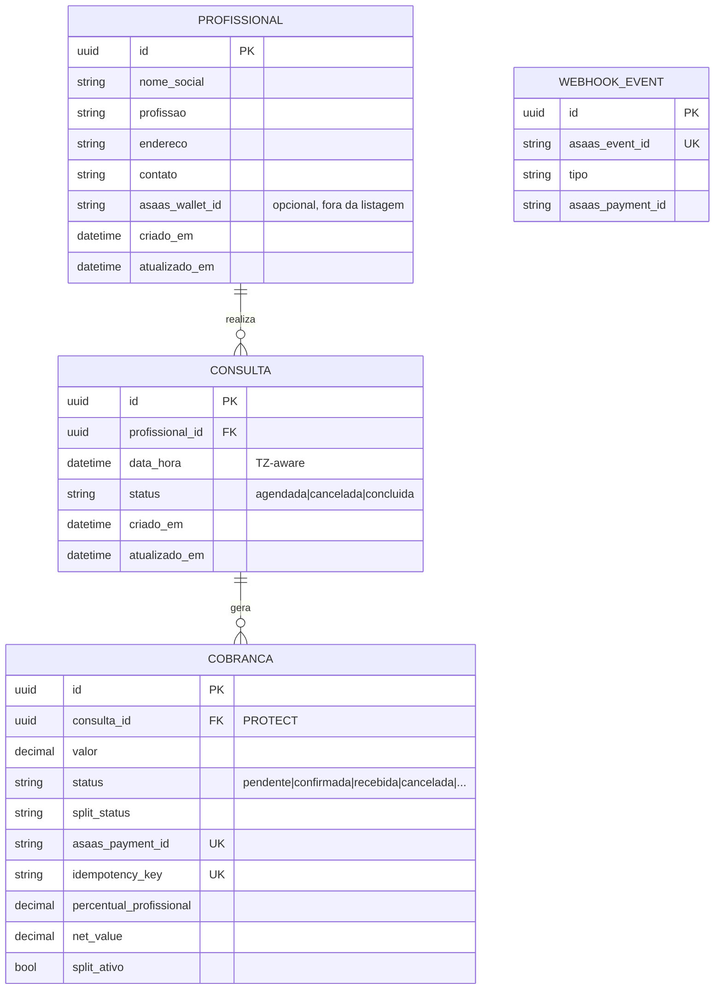

# Domínio: profissionais, consultas e cobranças

Contrato da API após a Fase 6. OpenAPI em `/api/schema/` (local/staging).

## Modelo



`Profissional` guarda apenas nome de tratamento. Nome civil, CPF, orientação sexual e identidade de gênero não existem no schema nem são aceitos no payload: o serializer declara campos explícitos, então qualquer chave extra é descartada.

`Cobranca.consulta` usa `on_delete=PROTECT` para **qualquer** status (AD-026). Excluir consulta ou profissional com cobrança vinculada devolve **409** (`consulta_com_cobranca` / `profissional_com_cobranca`). Sem cobrança, excluir profissional ainda cascateia as consultas (AD-015). `WebhookEvent` não persiste o body do Asaas.

## Endpoints

| Método | Rota | Sucesso | Erros |
| --- | --- | --- | --- |
| POST | `/api/v1/profissionais/` | 201 | 400 `validation_error` |
| GET | `/api/v1/profissionais/` | 200 (sem `contato`) | — |
| GET | `/api/v1/profissionais/{id}/` | 200 (com `contato`) | 404 `not_found` |
| PUT/PATCH | `/api/v1/profissionais/{id}/` | 200 | 400 `validation_error`, 404 `not_found` |
| DELETE | `/api/v1/profissionais/{id}/` | 204 | 404 `not_found`, **409 `profissional_com_cobranca`** |
| POST | `/api/v1/consultas/` | 201 | 400 `validation_error`, **409 `consulta_conflito`** |
| GET | `/api/v1/consultas/` | 200 | 400 `validation_error` (filtro malformado) |
| GET | `/api/v1/consultas/{id}/` | 200 | 404 `not_found` |
| PUT/PATCH | `/api/v1/consultas/{id}/` | 200 | 400 `validation_error`, 409 `consulta_conflito`, 404 `not_found` |
| DELETE | `/api/v1/consultas/{id}/` | 204 | 404 `not_found`, **409 `consulta_com_cobranca`** |
| POST | `/api/v1/consultas/{id}/cobrancas/` | 201 (cria) / 200 (replay da key) | 400 `idempotency_key_required` / `split_wallet_emissor`, 401, 404 `not_found` |
| POST | `/webhooks/asaas/` | 200 | 401 `not_authenticated` |

`contato` e `asaas_wallet_id` saem da listagem. O webhook não exige JWT: autentica pelo header `asaas-access-token`.

Criar cobrança exige `Idempotency-Key`. Sem o header: 400. Replay da mesma key: 200, mesmo `asaas_payment_id`, uma só linha. Body: `{valor, split?}` com `split` no formato OpenAPI (`walletId`, `percentualValue`). Sem `split`, o mock usa a wallet do profissional a 80%.

Máquina: `PAYMENT_CONFIRMED` → `confirmada` (não implica fundo disponível); `PAYMENT_RECEIVED` → `recebida` + split `concluido`. Pix pode pular CONFIRMED. CONFIRMED tardio não regride. Detalhe e ADR: [`docs/adr/0001-asaas-mock-first.md`](adr/0001-asaas-mock-first.md).

### Paginação

Toda listagem é paginada (`PageNumberPagination`):

```json
{
  "count": 42,
  "next": "http://host/api/v1/consultas/?page=2",
  "previous": null,
  "results": [ ... ]
}
```

| Parâmetro | Efeito |
| --- | --- |
| `page` | Página desejada; fora do intervalo devolve 404 `not_found` |
| `page_size` | Tamanho da página; default 20, teto 100 (valor maior é limitado ao teto) |

### Filtros de consulta

| Parâmetro | Efeito |
| --- | --- |
| `profissional=<uuid>` | Consultas do profissional |
| `status=agendada\|cancelada\|concluida` | Filtra por status |
| `data_hora_after=<ISO-8601>` | A partir do instante (inclusive) |
| `data_hora_before=<ISO-8601>` | Até o instante (inclusive) |
| `ordering=data_hora` / `ordering=-data_hora` | Ordenação; o default é `-data_hora` |

**Política do filtro sem resultado:** `?profissional=<uuid válido que não existe>` devolve **200 com lista vazia**, nunca 404. O 404 fica reservado para acesso a um recurso por id. Um valor que não é UUID devolve 400 `validation_error`.

## Contrato de erro

Toda resposta de erro usa o mesmo envelope:

```json
{
  "code": "consulta_conflito",
  "detail": "Já existe consulta agendada para este profissional neste horário.",
  "errors": {}
}
```

`errors` traz o mapa `campo -> [mensagens]` em erros de validação e fica vazio nos demais.

## Regra de agenda (anti–double booking)

A fonte da verdade é o banco:

```
UNIQUE (profissional_id, data_hora) WHERE status = 'agendada'
```

Uma segunda consulta `agendada` no mesmo slot falha no `INSERT`. A view salva dentro de `transaction.atomic()`, e ao receber `IntegrityError` reconfirma o slot para classificar o erro e responder 409 `consulta_conflito`. Duas consequências deliberadas:

- Cancelar libera o horário: com `status='cancelada'` a linha sai do índice parcial e o slot volta a aceitar agendamento.
- Não há checagem prévia em Python. Uma verificação antes do insert perderia a corrida entre dois workers; a constraint não perde.

Os validators derivados do DRF ficam desligados em `ConsultaSerializer.Meta` (`validators = ()`). Sem isso o DRF geraria um `UniqueTogetherValidator` a partir da constraint e responderia 400, escondendo o 409 exigido pelo contrato.

## Timezone

`TIME_ZONE=America/Sao_Paulo` com `USE_TZ=True`. Instantes são gravados em UTC e devolvidos com offset `-03:00`. Consultas com `status=agendada` não aceitam `data_hora` no passado; `cancelada` e `concluida` aceitam, porque são registro histórico.

## Migrations: política expand/contract

Migrations são versionadas por app (`apps/<app>/migrations/`) e passam pelo lint: depois de `makemigrations`, rode `ruff format` no arquivo gerado (as migrations não estão excluídas do lint, então o `make lint` cobra isso).

Mudança de schema em duas etapas, nunca uma só:

1. **Expand** — adicionar coluna nova como nullable ou com default, criar índice/constraint nova, deployar e fazer backfill. O código antigo continua funcionando.
2. **Contract** — só depois que nenhuma release ativa usa a coluna antiga, removê-la em uma migration separada.

Regra prática: nada de `AlterField` destrutivo ou `RemoveField` no mesmo deploy do código que depende da mudança. Isso é o que mantém o rollback da Fase 9 possível — voltar a versão anterior da aplicação não pode encontrar um schema que ela não sabe ler.

## Limitações honestas desta fase

| Limitação | Onde resolve |
| --- | --- |
| ~~Sem paginação~~ — resolvido na Fase 5: listagens paginadas com teto de 100 (AD-018 fechado) | Fase 5 ✔ |
| ~~Permissão default `AllowAny`~~ — resolvido na Fase 3: default `IsAuthenticated`, todas as rotas acima exigem Bearer JWT (ver `docs/seguranca.md`) | Fase 3 ✔ |
| Suíte local roda em SQLite; o índice parcial é suportado, mas o dialeto de produção é Postgres 16 (AD-017) | Fase 7 (CI em Postgres) |
| ~~`asaas_wallet_id` existe no modelo mas nenhum fluxo de pagamento o usa~~ — resolvido na Fase 6 (split default e seed) | Fase 6 ✔ |
